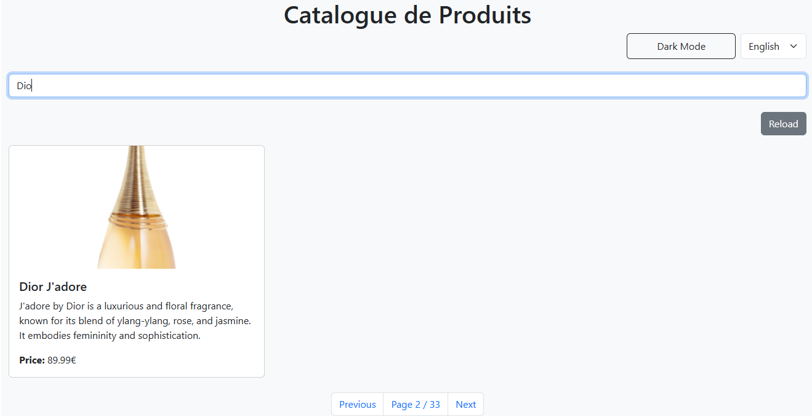
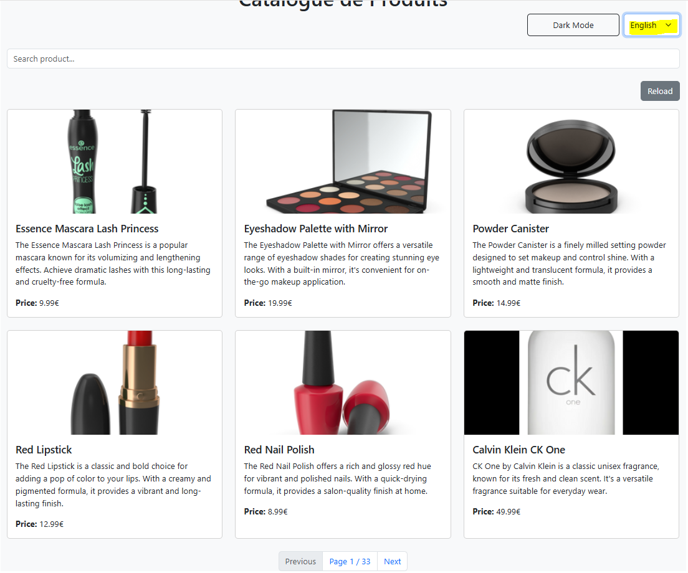
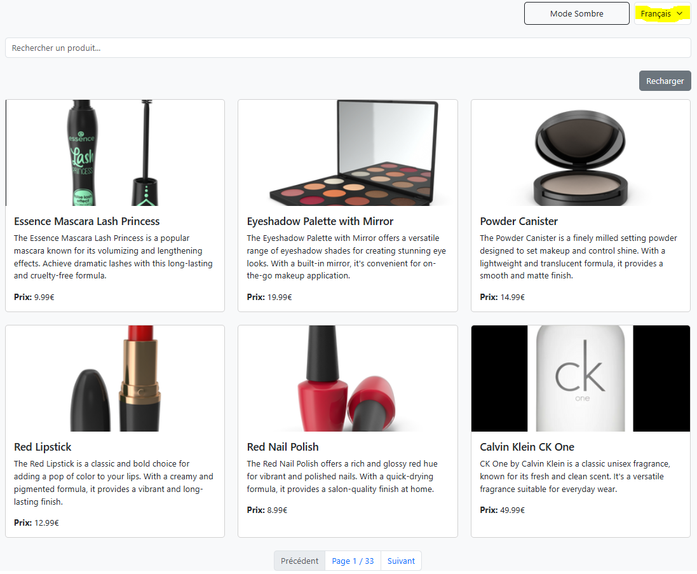
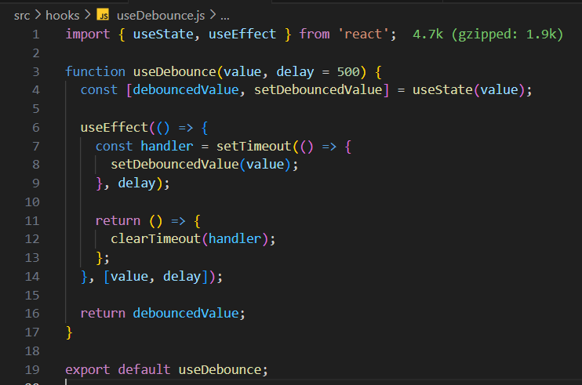
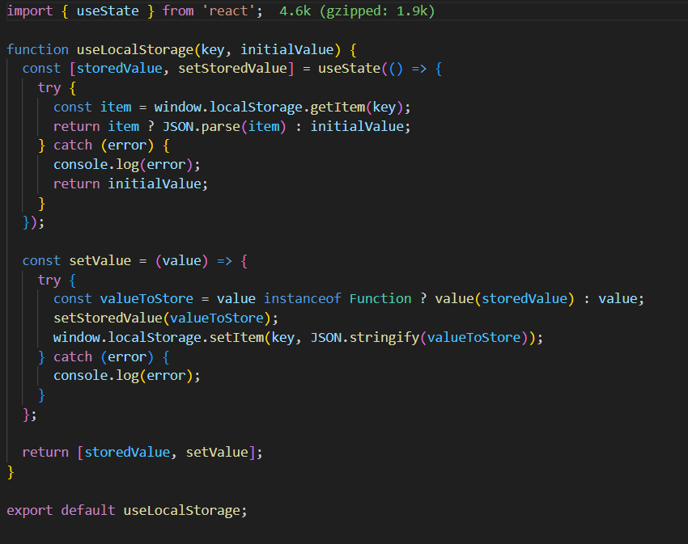
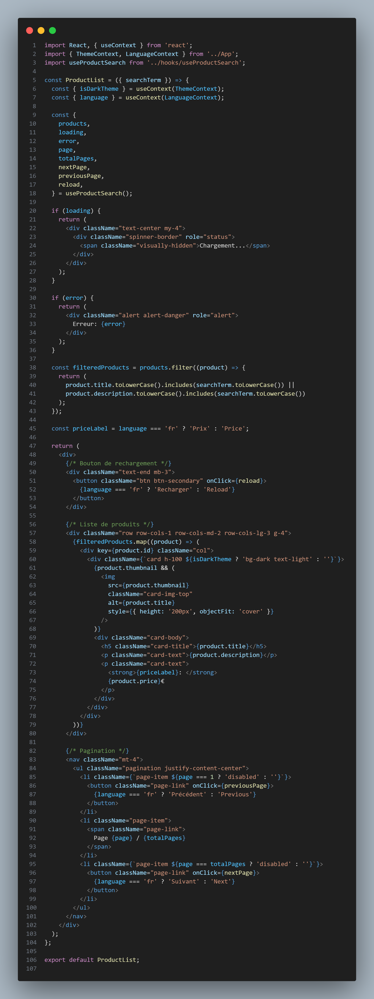
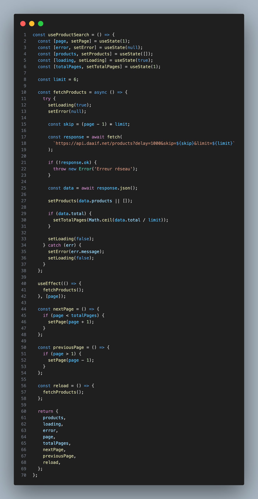

# TP React Hooks - Application de Gestion de Produits

Ce TP a pour objectif de mettre en pratique l'utilisation des Hooks React (useState, useEffect, useContext) ainsi que la création de Hooks personnalisés.

## Installation et configuration initiale

1. Cloner le dépôt :
```bash
git clone https://github.com/pr-daaif/tp-react-hooks.git
cd tp-react-hooks
```

2. Créer votre propre dépôt sur Github et changer le remote :
```bash
# Supprimer le remote origine
git remote remove origin

# Ajouter votre nouveau remote
git remote add origin https://github.com/[votre-username]/tp-react-hooks.git

# Premier push
git push -u origin main
```

3. Installer les dépendances :
```bash
npm install
```

4. Lancer l'application :
```bash
npm start
```

## Instructions pour le TP

Pour chaque exercice :
1. Lisez attentivement l'énoncé
2. Implémentez la solution
3. Testez votre implémentation (pensez à faire des copies d'écran)
4. Mettez à jour la section correspondante dans ce README avec :
   - Une brève explication de votre solution
   - Des captures d'écran montrant le fonctionnement
   - Les difficultés rencontrées et comment vous les avez résolues
5. Commitez vos changements avec un message descriptif

### Exercice 1 : État et Effets 
#### Objectif : Implémenter une recherche en temps réel

- [ ] 1.1 j'ai  implémenté la recherche en temps réel, j'ai utilisé le hook useState pour gérer l'état du terme de recherche (searchTerm) et le hook useEffect pour surveiller les changements de ce terme.

- [ ] 1.2 J'ai créé un hook personnalisé useDebounce qui utilise un setTimeout pour différer l'appel de la recherche.
Le hook retourne la valeur du terme de recherche uniquement après un délai (500 ms dans notre cas), ce qui permet de réduire le nombre de requêtes exécutées.




### Exercice 2 : Context et Internationalisation
#### Objectif : Gérer les préférences de langue

-  Pour permettre à l'utilisateur de basculer entre les langues, J' ai ajouté un sélecteur de langue dans le composant principal.
   Le sélecteur utilise le toggleLanguage du LanguageContext pour alterner entre le français (fr) et l'anglais (en).




### Exercice 3 : Hooks Personnalisés
#### Objectif : Créer des hooks réutilisables

- [ ] J'ai créé un hook personnalisé useDebounce pour différer l'exécution d'une action
      jusqu'à ce que l'utilisateur ait terminé une    saisie. 
      

- [ ]j'ai  créé un hook personnalisé useLocalStorage  Pour gérer le stockage
 et la récupération des données dans le Local Storage du navigateur, 



### Exercice 4 : Gestion Asynchrone et Pagination
#### Objectif : Gérer le chargement et la pagination

- [ ] Dans cet exercice, j'ai implémenté un bouton de rechargement pour actualiser la liste des produits sans recharger l'application entière. J'ai également ajouté la pagination pour diviser les produits en plusieurs pages, améliorant ainsi les performances et l'expérience utilisateur. La pagination permet de naviguer facilement entre les pages de produits à l'aide des boutons Précédent et Suivant. Cela optimise le chargement des données en récupérant un nombre limité de produits à la fois.




## Rendu

- Ajoutez l'URL de votre dépôt Github dans  **Classroom** et envoyer la réponse dès le démarage de votre projet.
- Les push doivent se faire au fûr et à mesure que vous avancez dans votre projet.
- Le README.md doit être à jour avec vos réponses et captures d'écran. 
- Chaques exercice doit faire l'objet d'au moins un commit avec un message mentionnant le numéro de l'exercice.